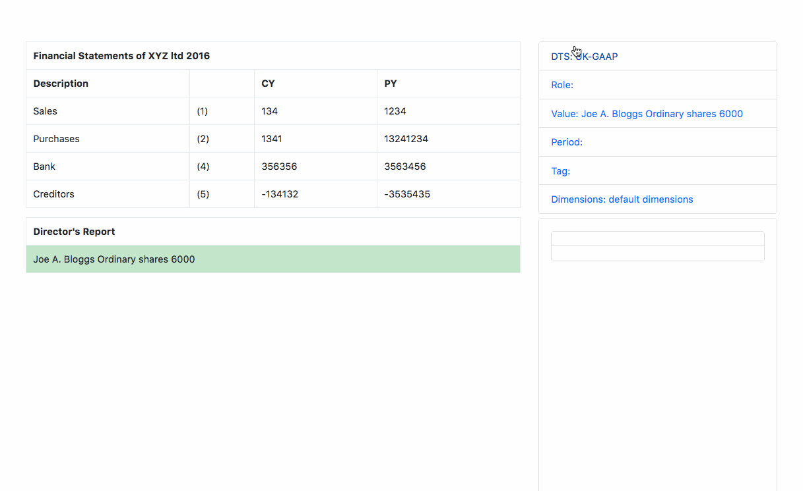

[](https://travis-ci.org/seocahill/ember-engine-xbrl-tagger)
[](https://codeclimate.com/github/seocahill/ember-engine-xbrl-tagger/maintainability)
[](https://codeclimate.com/github/seocahill/ember-engine-xbrl-tagger/test_coverage)

# Ember xbrl tagger engine

This is an ember engine used as part of the circle-accounts.com client.

This part of the app deals with the UI/logic of the Taxonomy tag picker.



## Interface

The engine expects the master app to expose a current-cell service is the table cell that is currently being tagged.

See the dummy current cell service for details.

## Running

An engine similarly to an addon can be served using ember cli on port 4200:

```
ember s
```

## Tests

Tests are run on headless chrome:
```
ember test --server
```

## Installation

* `git clone <repository-url>` this repository
* `cd ember-xbrl-tagger`
* `npm install`
